<p align="center">
  
</p>

<h1 align="center">
🚀 WebApp OneBitFoodProgLima 🚀
</h1>

<p align="center">
  

  

  <a href="https://github.com/Douglasproglima/OneBitFoodAll/commits/main">
    
  </a>

  <a href="https://github.com/Douglasproglima/FindHouses/issues">
    
  </a>

  
</p>

<p align="center">
  <a href="#-projeto">Projeto</a>&nbsp;&nbsp;&nbsp;|&nbsp;&nbsp;&nbsp;
  <a href="#rocket-tecnologias">Tecnologias</a>&nbsp;&nbsp;&nbsp;|&nbsp;&nbsp;&nbsp;<a href="#rocket-tecnologias">Aprendizado</a>&nbsp;&nbsp;&nbsp;|&nbsp;&nbsp;&nbsp;
<a href="#-layout">Layout</a>&nbsp;&nbsp;&nbsp;|&nbsp;&nbsp;&nbsp;
<a href="#rocket-executando">Cmd React/Nextjs</a>&nbsp;&nbsp;&nbsp;|&nbsp;&nbsp;&nbsp;

</p>
<br>

## 💻 Projeto

Esse projeto foi desenvolvido com o objetivo de me atualizar com a nova versão do Rails 6 e Reactjs usando o Nextjs.

Neste projeto, encontra-se uma API feita em Ruby on Rails 6 e a parte Web feita em Nextjs.

## :school_satchel: Aprendizados

### Frontend

- Reactjs + Nextjs
- Chamadas da API com SWR
- Como usar bootstrap em projeto React
- SASS
- Lib React-slick
- Recoil (Gerenciador de estado do React)

## :rocket: Tecnologias

Esse projeto foi desenvolvido com as seguintes tecnologias:

- [Reactjs](https://pt-br.reactjs.org/)
- [Nextjs](https://nextjs.org/)
- [React-Bootstrap](https://react-bootstrap.github.io/)

\* Para mais detalhes, veja o **[Gemfile](./GemFile)**

## 🎨 Layout

### Web

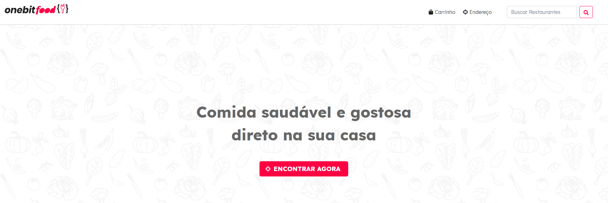

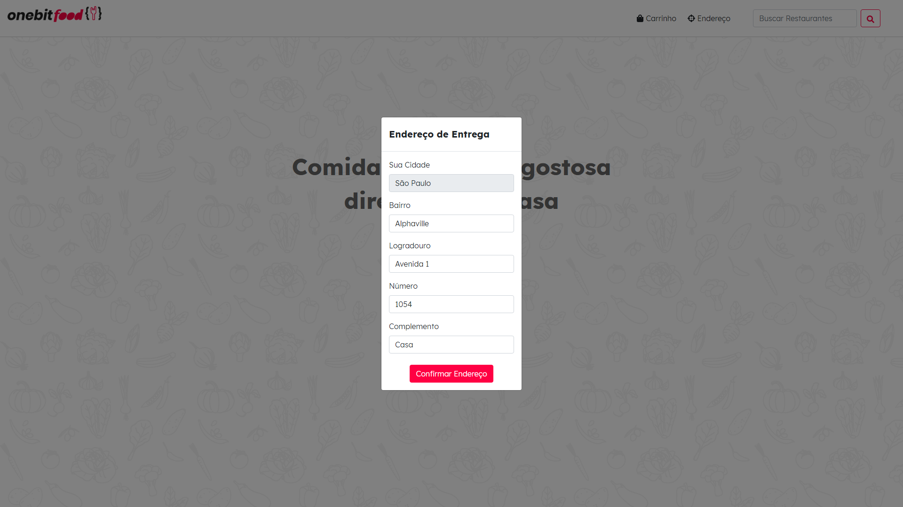

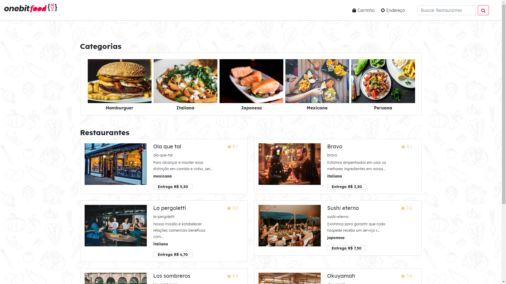

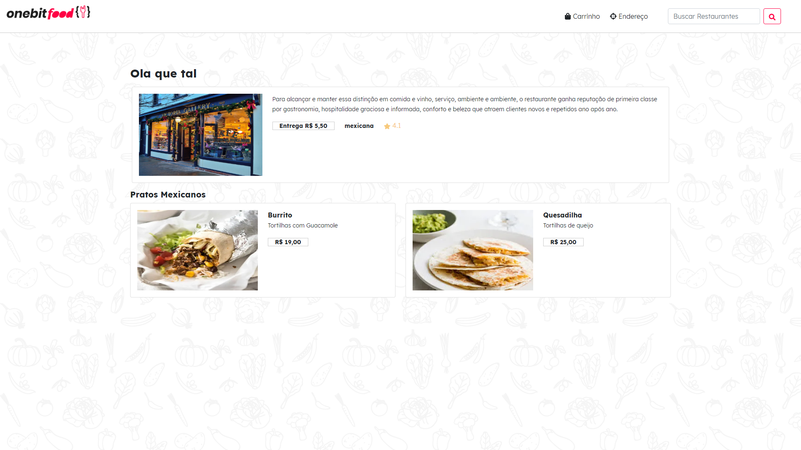

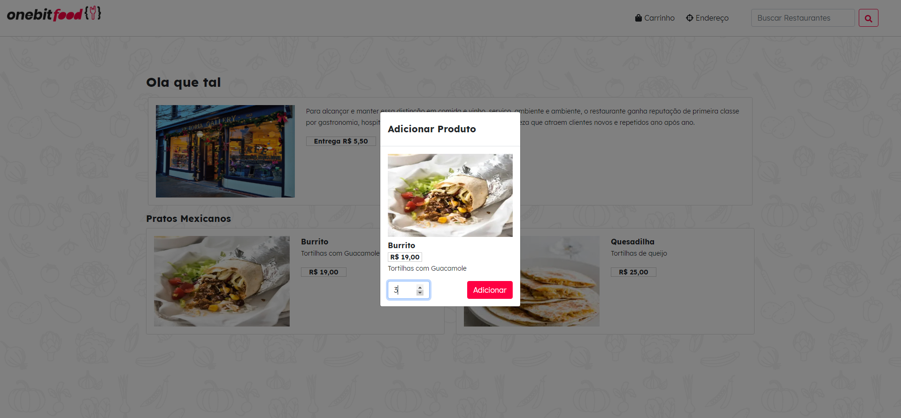

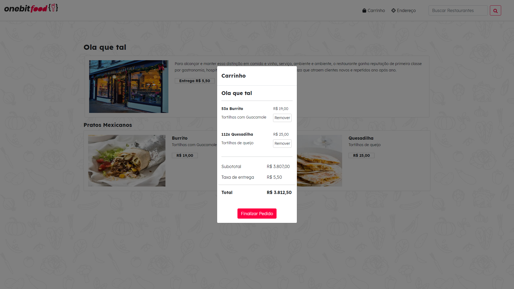

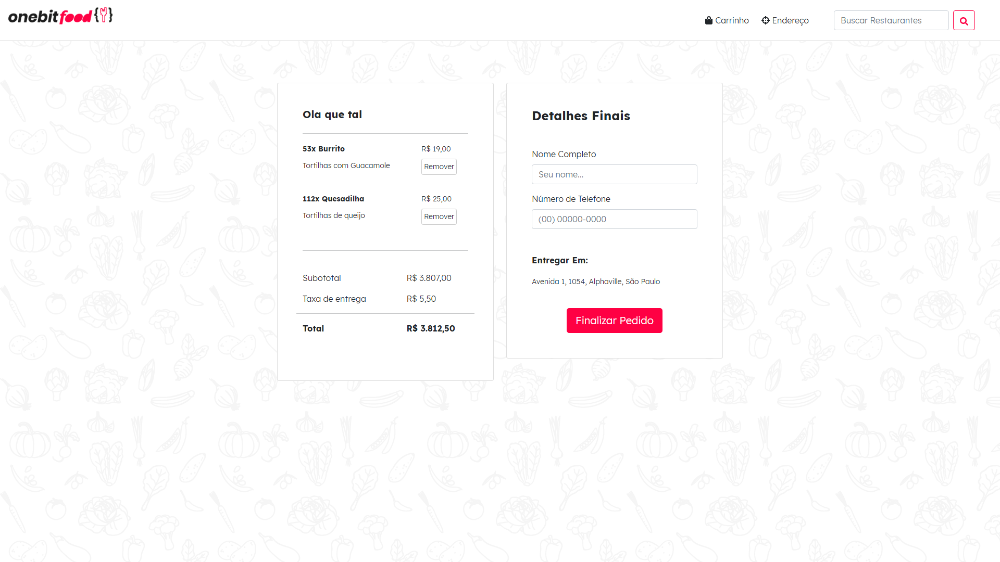

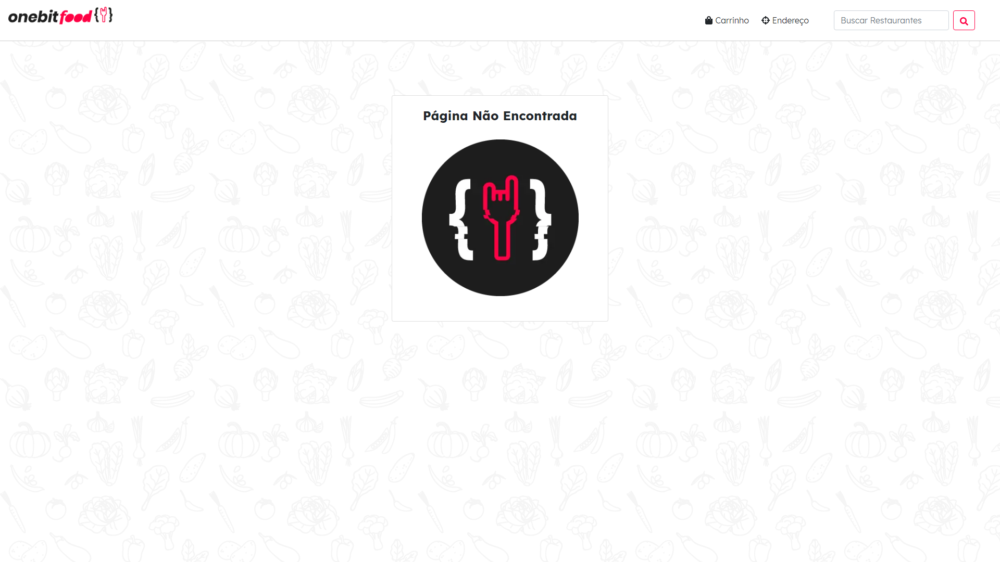

### Mobile


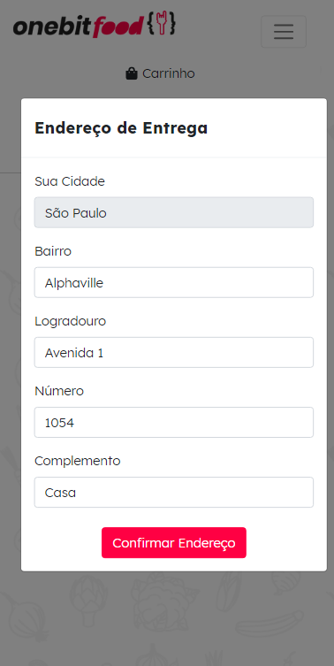

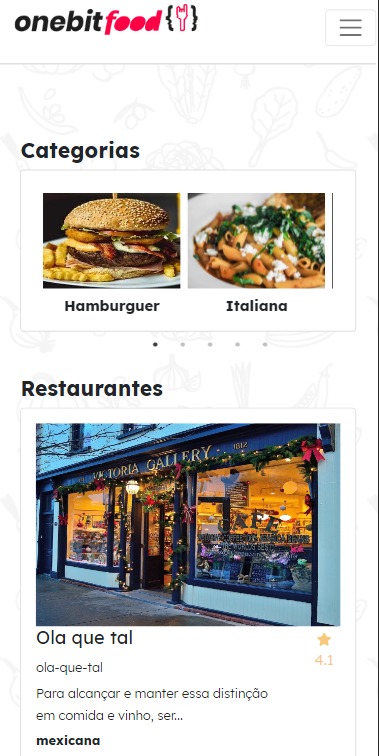

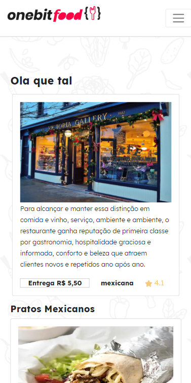

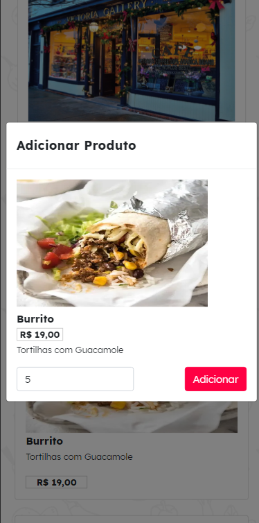

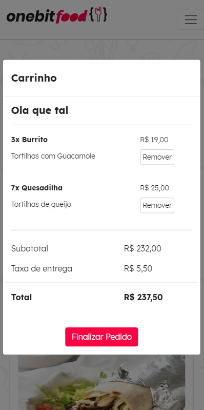

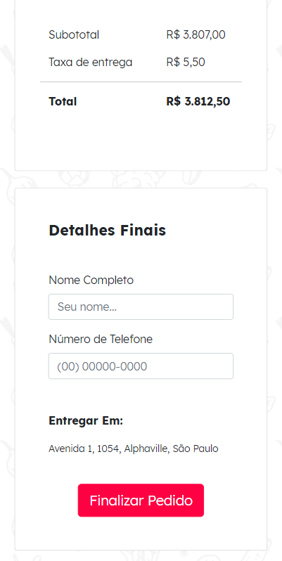

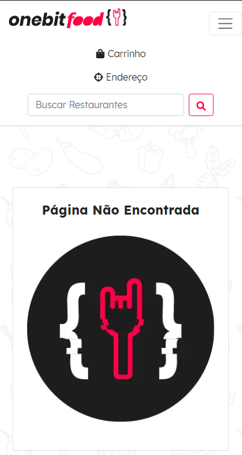

## :notebook: Cmd React/Nextjs

```bash
# Clone este repositório
$ git clone https://github.com/Douglasproglima/OneBitFoodAll.git

# Acesse a pasta do projeto no seu terminal/cmd
$ cd OneBitFoodAll/frontend

# Instale as dependências:
# React Hock para fetch data
# https://swr.vercel.app/
$ yarn add swr@0.5.5

# Node SASS
$ yarn add sass@1.32.12

# Framework CSS bootstrap
# https://react-bootstrap.github.io/components/alerts/
$ yarn add react-bootstrap@1.5.2 bootstrap@5.0.0

# Lib de Ícones
$ yarn add react-icons@4.2.0

# Lib para gerar o efeito carrosel
# https://react-slick.neostack.com/
$ yarn add slick-carousel@1.8.1 react-slick@0.28.1

# Recoil: Gerenciador de estado do ReactJs
# Dois principais pilares: Atoms e Selectors
# -> Atoms: Arquivos onde tem o estado global, onde vários componentes tem acesso a esse estado, é possível atualizar e ler estes estados
# -> Selectors: Funções puras cujo o objetivo é devolver os valores derivados dos atoms.
$ yarn add recoil@0.3.1 recoil-persist@2.9.0

# Instalar all Libs
$ yarn

# Servidor
$ yarn start
# OU
$ npm start
```
---

Feito com ❤️ por Douglas Lima </h2> [Entre em contato!](https://www.linkedin.com/in/douglasproglima) </h2>Créditos finais: [Onebitcode!](https://www.onebitcode.comhttps://onebitcode.com/)
